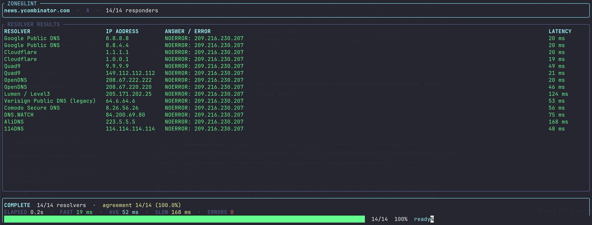

# Zoneglint

Zoneglint queries public DNS resolvers and shows their answers and response times. It follows the resolver comparison workflow in [digga](https://github.com/knowald/digga), with an independent Rust implementation.

This screenshot shows a completed run for news.ycombinator.com. DNS answers and latency values vary between runs.



## Build

Install Rust 1.88 or newer. From this directory, run:

```sh
cargo build --release
```

The executable will be at `target/release/zoneglint`.

## Releases

Push a version tag such as `v0.1.0` to build native binaries for Linux, macOS, and Windows and publish them as a GitHub Release:

```sh
git tag v0.1.0
git push origin v0.1.0
```

## Usage

```sh
zoneglint example.com
zoneglint example.com --type MX --simple
zoneglint example.com --json
zoneglint example.com --servers cloudflare,quad9 --timeout 3s
zoneglint example.com --fetch --fetch-count 20 --simple
```

Zoneglint queries `A` records by default. Choose another type with `--type` or `-t`: `AAAA`, `CNAME`, `MX`, `TXT`, `NS`, `SOA`, `PTR`, `SRV`, or `CAA`.

| Option | Description |
| --- | --- |
| `--type`, `-t` | DNS record type. |
| `--json` | Print one indented JSON document. Cannot be combined with `--simple`. |
| `--simple` | Print a plain text table. |
| `--timeout` | Set a positive timeout per resolver, such as `5s` or `800ms`. Defaults to `5s`. |
| `--servers` | Select built-in providers with a comma-separated list of IDs. |
| `--fetch` | Fetch additional resolvers from public-dns.info. |
| `--fetch-count` | Limit discovered resolvers to 1 to 500. Defaults to `30`. |

Provider IDs are `google`, `cloudflare`, `quad9`, `opendns`, `level3`, `verisign`, `comodo`, `dnswatch`, `alidns`, and `114dns`. The built-in list has 14 addresses. The `level3` filter uses an address listed in [Lumen's hosted VoIP network guide](https://docs.lumen.com/voip/equipment/configuring-your-network-for-hosted-voip-service/). The `verisign` entry is marked legacy because current first-party service documentation is unavailable.

When stdout is a terminal, Zoneglint shows progress as replies arrive. The TUI marks matching answers in green, differing answers in yellow, and resolver errors in red. Redirected output uses the plain table. Each query goes to the resolver's configured IP, and the operating system's resolver is not used. Zoneglint runs up to 32 queries at once. A timeout or error from one resolver leaves the other results intact.

The propagation summary groups replies by response code and normalized answers. Empty replies and negative DNS responses count as valid outcomes. Transport errors and timeouts stay in the denominator but do not join a group. A tie, or a run without valid DNS replies, has a null consensus.

## Network behavior

Each run sends the requested DNS query to every selected resolver. Zoneglint keeps no query history and sends no queries to a Zoneglint service. Resolver discovery is off unless you pass `--fetch`. That option downloads `https://public-dns.info/nameservers.csv`, keeps IPv4 entries with at least 95% reported reliability, and accepts at most two entries per country. If discovery fails, Zoneglint prints a warning to stderr and continues with the built-in list.
